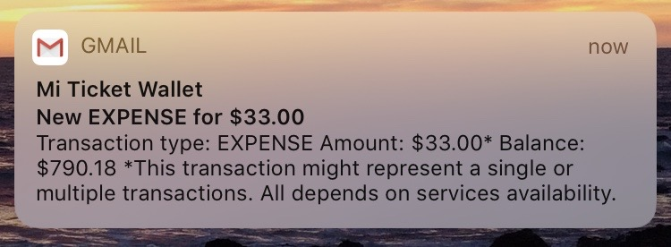

# Ticket Wallet Monitor
My employer provides groceries card benefit but provider's systems (Endered) sucks. A lot. It is hard to get notifications, transaction list, and so on. The only thing that usually works is get card's balance. This is my attempt to solve the inconveniences.



## Config the project
```bash
cp config/config.sample.json config/config.json
```

Edit `config.json` file and replace placeholders with your Endered credentials and SMTP server to get e-mail notifications.

## Run the project
```bash
npm install
npm run db
npm start
```

## Run the project in a Docker container

```bash
docker build --rm -t YOUR_USERNAME/tw-monitor .

docker run -itd \
-v "$(pwd)"/data:/app/data \
-e TICKET_WALLET_EMAIL=TICKET_WALLET_EMAIL \
-e TICKET_WALLET_PASSWORD=TICKET_WALLET_EMAIL \
-e SMTP_HOST=SMTP_HOST \
-e SMTP_PORT=SMTP_PORT \
-e SMTP_USER=SMTP_USER \
-e SMTP_PASSWORD=SMTP_PASSWORD \
-e TO_EMAIL=TO_EMAIL \
-e TZ=America/Mexico_City \
--restart unless-stopped \
YOUR_USERNAME/tw-monitor
```

Replace placeholders with proper values.

## Storage
I use an SQLite database, stored in `data` folder, which is bind mounted to the container.

